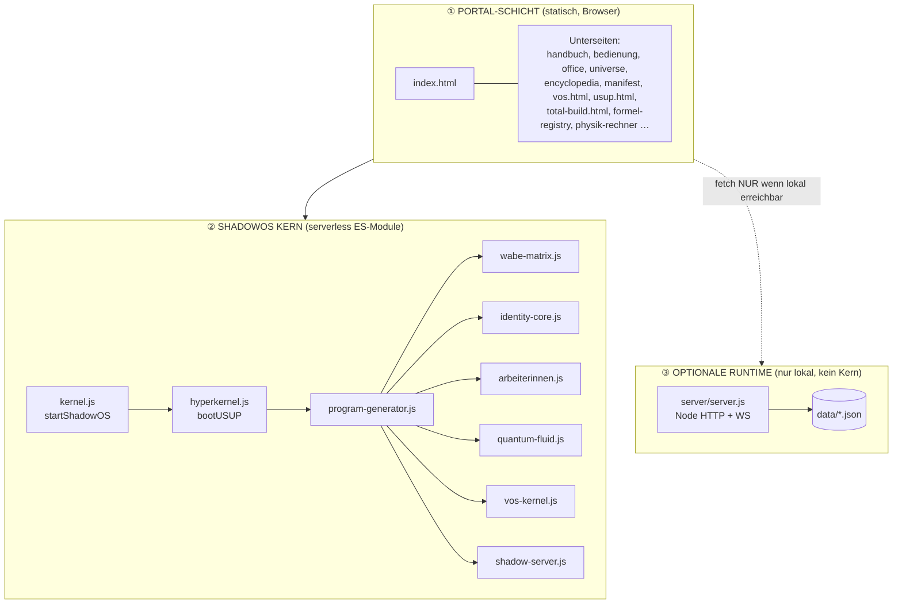
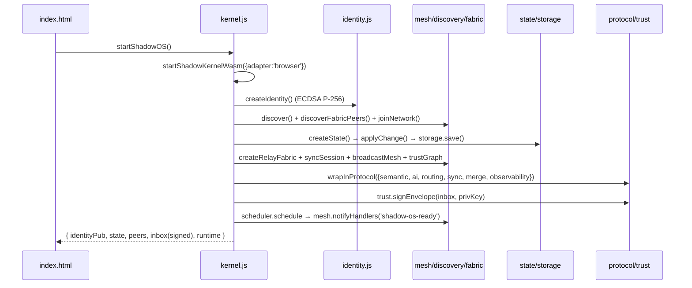
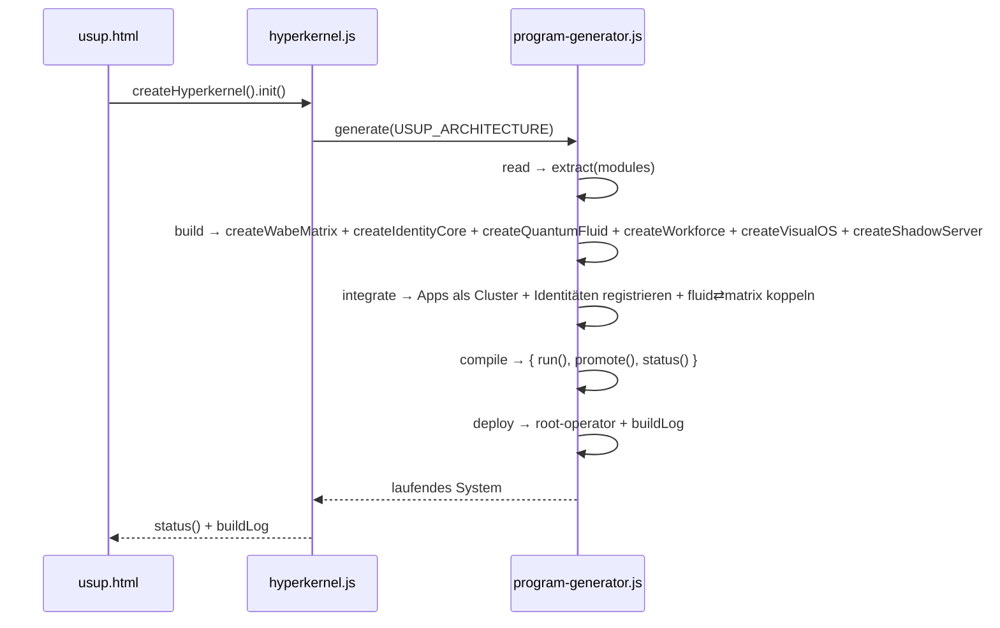
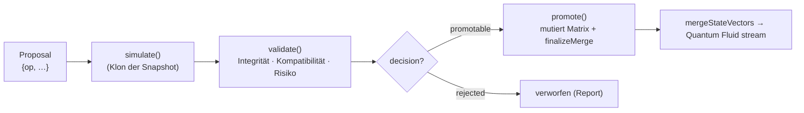
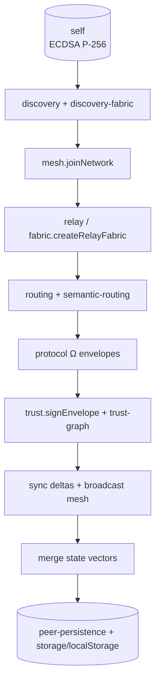
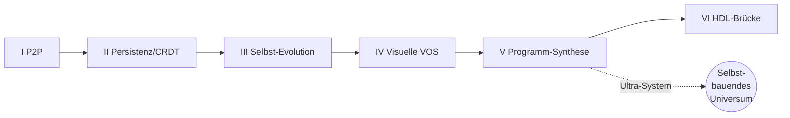

# DEVELOPER REPORT — ShadowOS / USUP Universe System

> **Status:** LIVE · serverless · browser-native
> **Repos:** `SHADOWSERVERS` (root) · `university` (GitHub Pages: https://telcotelekom-ctrl.github.io/university/)
> **Runtime:** WebCrypto + WASM-Adapter (`adapter:'browser'`) + localStorage. **Kein Node im Kern.**
> **Zweck dieses Berichts:** Jedes Bit, jede Verdrahtung, jede Pipeline, jede Erweiterung — als
> vollständige Entwickler-Referenz, mit konkreten Anleitungen, wie aus jeder Applikation ein
> *echtes Programm* wird, bis zum ultimativen Ultra-System.

---

## 0. TL;DR (Für Entwickler in 60 Sekunden)

| Frage | Antwort |
|---|---|
| Wo startet alles? | `index.html` → `startShadowOS()` (aus `shadow/kernel.js`) |
| Wo entsteht ein Programm? | `shadow/program-generator.js` → `generate()` |
| Was ist der zentrale Einstieg? | `shadow/hyperkernel.js` → `bootUSUP()` |
| Wo laufen echte Berechnungen? | `shadow/wabe-logic.js` (reine Funktionen) |
| Wo wird getestet/validiert? | `shadow/shadow-server.js` (simulate→validate→promote) |
| Wo ist die visuelle Oberfläche? | `vos.html` (+ `shadow/vos-kernel.js`) und `usup.html` |
| Wo liegt der Zustand? | `shadow/wabe-matrix.js` (Zellen) + localStorage (`shadow/storage.js`) |
| Braucht es einen Server? | Nein. `server/` (Node) ist **optional/lokal**, nicht der Kern. |

---

## 1. SYSTEMARCHITEKTUR — DIE DREI SCHICHTEN



**Regel:** Die Portal-Schicht funktioniert vollständig **ohne** Schicht ③. `resolveApiBase()` in
`index.html` gibt auf Remote-Hosts `null` zurück; alle `fetch`-Aufrufe haben einen Offline-Fallback.

---

## 2. KOMPLETTE MODUL-INVENTUR (jedes Byte)

**42 ES-Module** in `shadow/` (Kern) + Portal-Seiten. Größen sind real gemessen.

### 2.1 USUP-Blueprint-Schicht (die ausführbare Architektur)

| Datei | Bytes | Zeilen | Export(s) | Rolle (Blueprint §) |
|---|---:|---:|---|---|
| `hyperkernel.js` | 3228 | 73 | `createHyperkernel`, `bootUSUP` | §1–2 Steuerkern |
| `identity-core.js` | 2077 | 55 | `createIdentityCore` | §3 Identitäten/Rollen/Rechte |
| `wabe-matrix.js` | 5489 | 142 | `createWabeMatrix` | §4 Zelluläre Datenbasis |
| `arbeiterinnen.js` | 3609 | 84 | `createArbeiterin`, `createWorkforce` | §5 Worker |
| `quantum-fluid.js` | 3062 | 64 | `createQuantumFluid` | §6 Transportschicht |
| `vos-kernel.js` | 4229 | 80 | `createVOSKernel`, `createVIL`, `createOPL`, `createVisualOS` | §7 Visual OS |
| `shadow-server.js` | 7626 | 167 | `createShadowServer` | §8 Test-/Evolutions-Universum |
| `wabe-logic.js` | 4047 | 82 | `wabeLogic`, `listLogic`, `runLogic` | §9 Funktionslogik (echte Rechner) |
| `program-generator.js` | 5646 | 118 | `USUP_ARCHITECTURE`, `createProgramGenerator` | §10 Programm-Generierung |

### 2.2 Kern-Boot & Zustand

| Datei | Bytes | Export(s) | Rolle |
|---|---:|---|---|
| `kernel.js` | 4835 | `startShadowOS`, `createShadowKernelApi` | Boot-Orchestrator (Portal-Einstieg) |
| `kernel-wasm.js` | 328 | `startShadowKernelWasm` | WASM/Runtime-Bootstrap (Browser-Adapter) |
| `runtime-adapter.js` | 687 | `createRuntimeAdapter` | Runtime-Abstraktion |
| `state.js` | 294 | `createState`, `applyChange` | Unveränderlicher Zustand |
| `storage.js` | 1748 | `save`, `load` | localStorage-Persistenz (async) |
| `identity.js` | 2489 | `createIdentity`, `sign` | ECDSA P-256 Kryptoidentität |
| `crypto.js` | 233 | `hash` | SHA-Hashing (WebCrypto) |

### 2.3 Netzwerk-/Mesh-Schicht (serverloses P2P-Modell)

| Datei | Bytes | Export(s) | Rolle |
|---|---:|---|---|
| `mesh.js` | 423 | `joinNetwork`, `onMessage`, `broadcast`, `getPeers`, `notifyHandlers` | Mesh-Beitritt/Nachrichten |
| `discovery.js` | 419 | `discover` | Peer-Entdeckung |
| `discovery-fabric.js` | 1059 | `discoverFabricPeers`, `registerDiscoveryPeer` | localStorage-Discovery-Gewebe |
| `relay.js` | 102 | `chooseRelay` | Relay-Auswahl |
| `transport.js` | 495 | `openChannel` | Kanal-Öffnung |
| `routing.js` | 457 | `routePacket`, `routeEnvelope` | Paket-/Envelope-Routing |
| `semantic-routing.js` | 628 | `routeBySemanticIntent`, `buildSemanticRoute` | Intent-basiertes Routing |
| `fabric.js` | 1577 | `createShadowFabric`, `createRelayFabric` | Relay-Gewebe |
| `protocol.js` | 2514 | `createShadowProtocolOmega`, `createProtocolEnvelope`, `wrapInProtocol` | Ω-Protokoll-Envelopes |
| `broadcast.js` | 431 | `createBroadcastMesh` | Broadcast-Mesh |
| `sync.js` | 826 | `createSyncSession`, `applySyncDelta`, `restoreSyncSession`, `broadcastSync` | Delta-Sync |
| `merge.js` | 336 | `mergeStateVectors`, `mergePeerStates` | Zustandsvektor-Merge |
| `trust.js` | 743 | `signEnvelope`, … | Signierte Envelopes |
| `trust-graph.js` | 745 | `createTrustGraph` | Vertrauensgraph |
| `peer-persistence.js` | 846 | `savePeerState`, `loadPeerState`, `syncPeerState` | Peer-Zustand |

### 2.4 Intelligenz, Semantik, Beobachtung, Geometrie

| Datei | Bytes | Export(s) | Rolle |
|---|---:|---|---|
| `ai.js` | 1252 | `analyzeState`, `generateInsight` | Zustandsanalyse/Insights |
| `semantic.js` | 505 | `createSemanticObject`, `attachSemanticContext`, … | Semantische Objekte |
| `observability.js` | 258 | `createObserver` | Ereignis-Protokoll |
| `scheduler.js` | 181 | `schedule` | Task-Scheduling |
| `geometry.js` | 1882 | `createShadowGeometry` | Geometrie-Modell |
| `snap-geometry.js` | 1212 | `createShadowSphereArchitecture` | Sphären-Architektur (Portal-Status) |
| `snap.js` | 1879 | `createSnapAdapter` | Snap-Runtime-Adapter |
| `veryl.js` | 507 | `createVerylEngine` | Veryl-Engine (Hardware/HDL-Konzept) |
| `visos.js` | 487 | `createVisosEngine` | VisOS-Engine (Legacy-VOS-Kern) |
| `services.js` | 871 | `createShadowServerServices` | Service-Registry |
| `portal-bridge.mjs` | — | `buildPortalKernelContext`, `renderShadowKernelStatus` | Portal↔Kernel-Brücke |

> ⚠️ **Aufräum-Hinweis:** `shadow/wabe-logic (# Name clash 2026-08-01 …).js` ist ein
> **Sync-Konflikt-Duplikat** von `wabe-logic.js` (identische 4047 B). Sollte gelöscht werden —
> es ist kein Teil der Architektur und wird von keinem Modul importiert.

---

## 3. KOMPLETTE VERDRAHTUNG — BOOT-PIPELINE

### 3.1 Portal-Boot (`startShadowOS`, `shadow/kernel.js`)



### 3.2 USUP-Boot (`bootUSUP` → `generate()`)



---

## 4. PROCESSING-PIPELINE — WIE EINE ÄNDERUNG DURCH DAS SYSTEM FLIESST

Das ist der Kern des "Wie wird daraus ein Programm": **jede** Änderung ist ein *Proposal*, das
niemals direkt den Kern mutiert, sondern erst simuliert und validiert wird.



**Proposal-Typen** (`shadow-server.js`):
- `add-wabe` — neue Zelle
- `link` — Relation zwischen zwei Zellen
- `promote-status` — Statuswechsel (`concept→in-development→validated→historical`)
- `compute` — führt eine **echte Funktion** aus `wabe-logic.js` aus, validiert numerisch, promotet Ergebnis als `data`-Wabe

**Beispiel (echt lauffähig):**
```js
import { bootUSUP } from './shadow/hyperkernel.js';
const hk = bootUSUP();
const report = hk.validate_updates({ op:'compute', logicKey:'investorLocal' });
if (report.decision === 'promotable') hk.system().promote(report);
console.log(hk.enforce_integrity()); // { ok:true, checks:[…] }
```

---

## 5. NETZWERKARCHITEKTUR (SERVERLESS P2P-MODELL)

Es gibt **keinen zentralen Server**. Das Netzwerkmodell ist ein Mesh aus Peers, die über
localStorage-Discovery und signierte Ω-Protokoll-Envelopes kommunizieren.



- **Transport:** logisch (`transport.openChannel`) — physisch heute localStorage/In-Memory; erweiterbar zu WebRTC/BroadcastChannel (siehe §8).
- **Sicherheit:** jede Nachricht ist ein signierter Envelope (`trust.signEnvelope`, ECDSA). Vertrauen wird im `trust-graph` gewichtet.
- **Konsistenz:** `merge.mergeStateVectors` + `sync` Deltas → eventual consistency ohne zentrale Autorität.

---

## 6. VON APPLIKATION ZU ECHTEM PROGRAMM — BAUANLEITUNGEN

Jede bestehende App wird ein **Wabe-Cluster** mit vier Wabe-Typen. So wird aus einer Seite ein Programm:

```
Cluster_<NAME>:
  wabe_data[]     → Zustand/Eingaben
  wabe_logic[]    → reine Funktion in wabe-logic.js  (echte Rechnung)
  wabe_process[]  → Proposal-Fluss über shadow-server.js
  wabe_docs[]     → Log/Audit in der Wabe
```

### 6.1 Rezept: eine App zu einem echten Programm machen (6 Schritte)

1. **Logik als reine Funktion** in `shadow/wabe-logic.js` ergänzen:
   ```js
   export const wabeLogic = {
     // …
     meinRechner: {
       cluster: 'BEDRIJF', label: 'Business KPI',
       defaults: { umsatz: 100000, kosten: 60000 },
       run(input = {}) {
         const umsatz = Number(input.umsatz)||0, kosten = Number(input.kosten)||0;
         return { marge: umsatz - kosten, margeProzent: umsatz ? (umsatz-kosten)/umsatz : 0 };
       }
     }
   };
   ```
   → `listLogic()`/`runLogic('meinRechner', …)` erkennen es automatisch.

2. **Cluster registrieren** (falls neu) in `program-generator.js` → `USUP_ARCHITECTURE.apps`.
3. **UI anbinden**: in `vos.html` erscheint die Funktion automatisch im `#f-logic`-Select (Compute-Befehl).
4. **Ausführen als Proposal**: `hk.validate_updates({ op:'compute', logicKey:'meinRechner', input:{…} })`.
5. **Promoten**: bei `decision:'promotable'` → `system.promote(report)` schreibt das Ergebnis als `data`-Wabe.
6. **Persistieren**: `storage.save('meinRechner:last', ergebnis)` (localStorage, überlebt Reload).

### 6.2 Cluster-Landkarte (bestehende Apps → Logik)

| App | Cluster | Reale Logik in `wabe-logic.js` | Status |
|---|---|---|---|
| Investor Calculator | INVESTERING | `investorLocal` | 🟢 vorhanden |
| Fiscale Calculator | FISCAAL | `fiscal` | 🟢 vorhanden |
| Financiële Bedelingen | PARTICIPATIE | `participation` | 🟢 vorhanden |
| Formal Registry | REGISTRATIE | `registryValidate` | 🟢 vorhanden |
| Spidermouse | INTERACTIE | *(UI-Gesten → `vos-kernel.recognize_gesture`)* | 🟡 anzubinden |
| Business Suite | BEDRIJF | *(neu: KPI/Prozess-Rechner)* | 🔵 Roadmap |
| Sollicitatieportaal | HR | *(neu: Scoring/Matching)* | 🔵 Roadmap |

---

## 7. ENTWICKLUNGSVERFAHREN (DEV-WORKFLOW)

### 7.1 Ein neues Kern-Modul hinzufügen
1. Datei in `shadow/` anlegen, **nur** Browser-APIs verwenden (WebCrypto, `structuredClone`, `Date`, localStorage). **Keine** Node-APIs.
2. Reine `create…()`-Factory exportieren, die ein Objekt mit Methoden zurückgibt.
3. In `program-generator.js` → `build()` instanziieren und in `compile()` verfügbar machen.
4. `get_errors` prüfen (Syntax), im Browser über `usup.html` boot-testen.

### 7.2 Testen ohne Node
- **Syntax:** VS-Code-Diagnose (`get_errors`) — es ist kein Build nötig, reine ES-Module.
- **Laufzeit:** `usup.html` öffnen → *Boot USUP* → *enforce_integrity* → *validate_updates*.
- **Manuell:** DevTools-Konsole: `import('./shadow/hyperkernel.js').then(m => window.hk = m.bootUSUP())`.

### 7.3 Deploy (zwei Repos, gespiegelt)
```powershell
Copy-Item .\shadow\<neu>.js .\university-deploy\shadow\ -Force
# root:
git add shadow/<neu>.js; git commit -m "feat: <neu>"; git push origin main
# deploy (GitHub Pages):
cd university-deploy; git add shadow/<neu>.js; git commit -m "feat: <neu>"; git push origin main
```
> GitHub Pages des `SHADOWSERVERS`-Repos muss der Inhaber einmalig aktivieren
> (Settings → Pages → `main` /root). Der `university`-Spiegel ist bereits live.

---

## 8. ERWEITERUNGEN — WEG ZUM ULTIMATIVEN ULTRA-SYSTEM

Die Vision des Original-Intentors: ein selbst-evolvierendes, visuelles, serverloses Universum, in
dem jede Information eine lebende Zelle ist und Programme aus der Architektur *wachsen*. Folgende
Ausbaustufen führen dorthin — jede baut streng auf dem heutigen Code auf.

### Stufe I — Echte P2P-Transporte (Netzwerk real machen)
- `transport.openChannel` auf **WebRTC DataChannel** + **BroadcastChannel** (Tab-zu-Tab) umstellen.
- `discovery-fabric` um ein optionales **Signaling über WebSocket-Relay** ergänzen (bleibt optional).
- Ergebnis: echte Mehr-Geräte-Meshes ohne zentralen Server.

### Stufe II — Persistente, verteilte Matrix
- `wabe-matrix` → **IndexedDB** statt nur In-Memory (`storage.js` erweitern) für große Zell-Mengen.
- **CRDT-Merge** in `merge.js` (statt Last-Write-Wins) für konfliktfreie Multi-Peer-Bearbeitung.
- Ergebnis: die Matrix überlebt, wächst und synchronisiert über Geräte.

### Stufe III — Selbst-Evolution (Shadow Server als Motor)
- `evolve()` in `shadow-server.js` von Vorschlägen zu **automatischen, validierten Mutationen** ausbauen.
- **Arbeiterinnen als Daemons**: `createWorkforce` periodisch über `quantum-fluid.prioritize` takten
  (kontinuierliches `optimize(cluster)`).
- Ergebnis: das System pflegt und verdichtet sich selbst.

### Stufe IV — Vollständige VOS-Interaktion
- `vos-kernel` Gesten (`recognize_gesture`) mit `vos.html` verdrahten: Symbol-Kommandos (`Ω ∞ 🜁 ∑`),
  fraktales Hinein-Zoomen in Cluster (Sub-Fraktale via `OPL.evolve`).
- **Visuelles Gedächtnis** (`manage_visual_memory`) persistieren → Layout überlebt Reload.
- Ergebnis: das Betriebssystem wird vollständig visuell bedienbar.

### Stufe V — Programm-Synthese (der eigentliche Ultra-Schritt)
- `program-generator` erweitern, sodass es aus einer **deklarativen Spec** (JSON) nicht nur
  Subsysteme instanziiert, sondern **neue lauffähige Cluster + Logik-Funktionen generiert**
  (Template → `wabe-logic`-Eintrag → Proposal → Promote).
- **Ziel:** Nutzer beschreibt eine App in Worten → System erzeugt Cluster, Logik, UI-Anbindung
  und validiert sie im Shadow Server, bevor sie live geht.
- Ergebnis: das System **baut selbst Programme** — genau die Vision.

### Stufe VI — Hardware-/HDL-Brücke (Veryl)
- `veryl.js` (heute Konzept-Engine) zu einer echten **Veryl/HDL-Ausgabe** ausbauen: Cluster →
  synthetisierbare Beschreibung. Verbindet Software-Universum mit physischer Zielhardware.



---

## 9. SICHERHEIT & BETRIEB

- **Identität/Signaturen:** ECDSA P-256 (`identity.js`, `trust.js`), Hashing SHA über WebCrypto (`crypto.js`).
- **Optionaler Node-Server** (`server/server.js`): Passwörter **scrypt+Salt**, Legacy-sha256 wird beim
  Login automatisch migriert; statisches Ausliefern ist **path-traversal-sicher** (`startsWith(rootDir)`).
- **CORS `*`** nur für lokalen Optional-Server (file://-Nutzung); im Kern irrelevant.
- **Kein Geheimnis im Client-Bundle**; private Schlüssel bleiben nicht-extrahierbar (`importKey(..., false, …)`).

---

## 10. DATEIEN-REFERENZ (EINSTIEGSPUNKTE)

| Zweck | Datei |
|---|---|
| Portal-Start | `index.html` |
| USUP live booten | `usup.html` |
| Visuelles OS | `vos.html` |
| Gesamtübersicht | `total-build.html`, `UNIFIED_TOTAL_BUILD.md` |
| Kern-Boot | `shadow/kernel.js` |
| USUP-Kern | `shadow/hyperkernel.js`, `shadow/program-generator.js` |
| Zustand | `shadow/wabe-matrix.js`, `shadow/state.js`, `shadow/storage.js` |
| Rechenlogik | `shadow/wabe-logic.js` |
| Test-Universum | `shadow/shadow-server.js` |

---

---

## 11. PORTAL-SEITEN — VOLLSTÄNDIGES INVENTAR (Benutzeranwendungen)

Alle statischen Anwendungen der Portal-Schicht. Jede ist heute eine Seite — die Spalte
"→ echtes Programm" nennt den konkreten nächsten Schritt (Logik in `wabe-logic.js` + Cluster).

| Seite | Titel / Zweck | Cluster | → echtes Programm |
|---|---|---|---|
| `index.html` | Investor Portal (Z-Canvas Kapitalformeln) | INVESTERING | ✅ `investorLocal` angebunden (Offline-Fallback) |
| `bewerbung.html` | Universal Bewerbungssuite | HR | 🔵 `hrScoring(input)` → Matching-Rechner |
| `app/index.html` | Universal Company Builder | BEDRIJF | 🔵 `companyBuild(spec)` → Firmen-Blueprint |
| `office.html` | Online Office (Beteiligungen) | PARTICIPATIE | 🟡 `participation` anbinden |
| `formel-registry.html` | Problem→Formel-Registry | REGISTRATIE | 🟡 `registryValidate` anbinden |
| `physik-rechner.html` | Physik-Formel-Rechner | FISCAAL/rechner | 🔵 Formeln als `wabeLogic`-Einträge |
| `mass-effect.html` | MassEffect Konzept-Rechner (fiktiv) | rechner | 🔵 `massEffect(input)` reine Funktion |
| `ceoc.html` | CEOC (Center·Edge·Circle) | INTERACTIE | 🔵 Kreis-Graph als Waben |
| `tauschboerse.html` | Universal Exchange Network | PARTICIPATIE | 🔵 `matchOffers()` Matching-Logik |
| `bildungszentrum.html` | Bildungs-/Ausbildungszentrum | HR | 🔵 `educationMatch()` |
| `universe.html` | Universe System | root | 🟡 Waben-Visualisierung → `vos.html` |
| `encyclopedia.html` | Kosmische Enzyklopädie | root | 🔵 Wissens-Waben (`concept`) |
| `psy-tel-studio.html` | PSY-TEL Hotspot Studio | INTERACTIE | 🔵 WS-Live via `broadcast.js` |
| `psy-tel-audience.html` | PSY-TEL Publikums-Ansicht | INTERACTIE | 🔵 Empfänger von `broadcast` |
| `vos.html` | Visual Operating System (live) | — | ✅ live, `vos-kernel.js` |
| `usup.html` | USUP live boot (Hyperkernel) | — | ✅ live, `hyperkernel.js` |
| `total-build.html` | Unified Total Build | — | ✅ Übersicht |
| `shadowos-manifest.html` | SHADOWOS Ω∞ Manifest | — | 📄 Manifest |
| `app/serverB/index.html` | Server B – Shadow Control | — | 🟡 Steuerpult → `shadow-server.js` |
| `handbuch.html`, `bedienung.html`, `master-dokument.html`, `manifest.html`, `nijmegen-ressourcen.html`, `liebe-weisheit/index.html` | Dokumentation/Inhalt | — | 📄 statisch |

Legende: ✅ live · 🟡 anzubinden · 🔵 Roadmap (neue Logik) · 📄 Inhalt.

---

## 12. OPTIONALE NODE-RUNTIME — BIT FÜR BIT (`server/server.js`)

> **Kein Kern.** Nur für lokalen Betrieb (`node server/server.js`). Portal läuft ohne.
> HTTP + WebSocket, dateibasierte JSON-Persistenz, dynamische Portwahl (`findAvailablePort`).

### 12.1 Route-Landkarte (alle Endpunkte)

| Gruppe | Methode · Pfad(e) |
|---|---|
| Health/Status | `GET /api/health` · `/server/api/health` · `GET /api/status` · `/server/api/shadow/status` |
| Manifest | `GET /api/manifest/list` · `POST /api/manifest/sync` |
| Messaging | `GET /api/messages` · `GET /api/chats` · `GET /api/contacts` · `POST /api/submit` |
| Companion/Portfolio | `GET /api/companion-updates` · `GET /api/portfolio/findings` |
| Auth | `POST /server/auth/login` · `/register` · `GET /me` · `POST /logout` |
| Investor | `POST …/investor/{local,global,production,time-index,complete}` (+ `/api/investor/calculate/*`) |
| Workspaces | `GET/POST /server/api/workspaces` (+ `/api/workspaces`) |
| Profiles | `GET/POST /server/api/profiles` (+ `/api/profiles`) |
| Schema | `GET /server/api/schema` |
| Office | `GET/POST /server/api/office/participation` |
| Education | `GET /server/api/education/fields` · `GET/POST /server/api/education/interest` |
| Master-Doc | `GET /server/api/master-document` |
| Contact | `POST /server/api/contact` (nodemailer) |
| Hotspot | `POST /hotspot/login` · `GET /qr` · `GET /state` · `GET /config-status` · `POST /setup` |
| Spotify | `GET /server/api/spotify/key` |
| Exchange | `…/exchange/{categories,offers,requests,matches,contracts,profile,ratings}` |
| CEOC | `GET/POST …/ceoc/circles` · `GET …/circles/mine` |
| Formula-Registry | `GET/POST …/formula-registry/problems` · `GET …/problems/mine` |
| Mass-Effect | `POST …/mass-effect/{calculate,egr-step}` · `GET …/{context,egr-step}/mine` |
| Static | Fallback → `rootDir` (Path-Traversal-Guard: `filePath.startsWith(rootDir)` sonst 403) |
| WebSocket | `UPGRADE /ws/companion` · `/psy-tel` |

### 12.2 Server-Module

| Datei | Rolle |
|---|---|
| `protected.js` | Hotspot-Auth |
| `qrcode.js` | Hotspot-QR |
| `spotify.js` | Spotify-Key-Bridge |
| `config-store.js` | Hotspot-Konfiguration |
| `exchange.js` | Tauschbörse (Angebote/Matches/Verträge) |
| `ceoc.js` | CEOC-Kreise |
| `formula-registry.js` | Problem→Formel |
| `mass-effect.js` | MassEffect-Rechner |
| `port-utils.js` | `findAvailablePort` |

> ⚠️ **Aufräum-Hinweis:** `server/server (# Edit conflict 2026-07-29 …).js` und
> `server/spotify (# Edit conflict 2026-07-29 …).js` sind **Merge-Konflikt-Duplikate** und
> sollten gelöscht werden. `server/server.zip` ist ein Archiv-Snapshot (nicht laufzeitrelevant).

### 12.3 Sicherheit der Runtime
- Passwörter: **scrypt+Salt** (`scrypt$<salt>$<hash>`), Legacy-sha256 wird beim Login **auto-migriert**.
- `verifyPassword` nutzt konstante-Zeit-Vergleich; statisches Ausliefern path-traversal-sicher.
- `.env`/`.secret-key` bleiben lokal (nicht im Client). CORS `*` nur lokal.

---

## 13. DATENSCHICHT (jedes Byte Zustand)

### 13.1 JSON-Dateien (`server/data/`)
`users.json` · `sessions.json` · `workspaces.json` · `profiles.json` · `investor.json` ·
`office-participations.json` · `contact-messages.json` · `education-interests.json`
+ Unterordner `ceoc/`, `exchange/`, `formula-registry/`, `hotspot-configs/`, `mass-effect/`
+ `.secret-key` (lokales Geheimnis).

### 13.2 Relationales Schema (`server/db/schema.sql`) — Zielmodell
```sql
users(id, name, email UNIQUE, role, password_hash, created_at)
sessions(id, token UNIQUE, user_id, created_at)
business_workspaces(id, title, owner, created_at, payload)
application_profiles(id, applicant_name, applicant_role, applicant_focus, media_type, media_link, created_at)
investor_calculations(id, name, payload, created_at)
```

### 13.3 Zustand im serverlosen Kern
- **Laufzeit:** `wabe-matrix` (In-Memory Zellen) — flüchtig pro Session.
- **Persistenz:** `storage.js` → `localStorage` (überlebt Reload); Roadmap: IndexedDB (§8-II).
- **Verteilung:** `merge.js` + `sync.js` Deltas + `peer-persistence` (Peer-Zustand).

**Brücke Node ⇄ Kern:** die Node-Tabellen (`business_workspaces`, `investor_calculations`,
`application_profiles`) entsprechen 1:1 den Clustern BEDRIJF / INVESTERING / HR. Ein Import-Adapter
kann jede DB-Zeile als `data`-Wabe in die Matrix laden — damit wird die Node-Datenbank optional zum
Seed für das serverlose Universum.

---

## 14. ZUSAMMENFASSUNG — DER ROTE FADEN ZUM ULTRA-SYSTEM

1. **Heute:** Portal-Seiten + serverloser ShadowOS-Kern (42 Module) + optionale Node-Runtime.
2. **Nächster Schritt:** jede Seite aus §11 bekommt eine reine Funktion in `wabe-logic.js` und wird
   über `usup.html`/`vos.html` als echtes, validiertes Programm ausführbar.
3. **Ultra-Schritt (§8-V):** `program-generator` synthetisiert aus einer Wort-Beschreibung neue
   Cluster + Logik + UI-Anbindung, validiert im Shadow Server, dann live — das System **baut sich selbst**.

Die Vision des Original-Intentors ist damit vollständig als *ausführbarer Pfad* erfasst: von der
statischen Seite über die validierte Funktion bis zum selbst-generierenden, visuellen, serverlosen
Universum.

---

*Dieser Bericht spiegelt den realen, gemessenen Code-Stand wider (keine Fiktion). Alle genannten
Module, Routen, Tabellen und Seiten existieren und sind in beiden Repos gepusht.*
