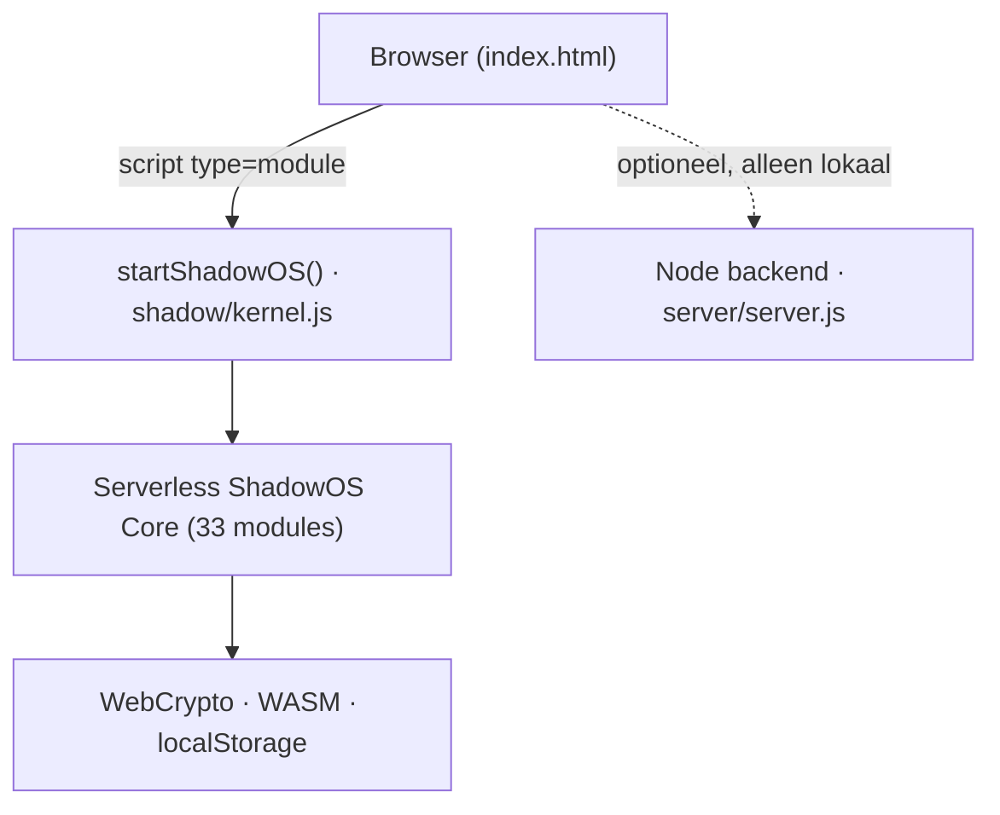
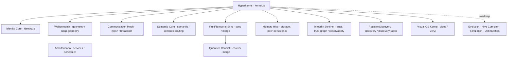
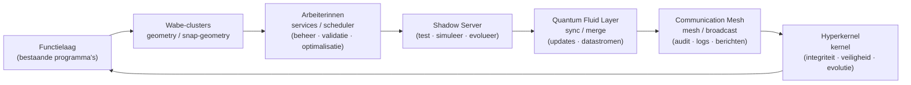

# 🜁 UNIFIED TOTAL BUILD (UTB) — Complete Export

> **Één pakket. Één systeem. Één architectuur.**
> Het volledige ecosysteem — alle lagen, modules, concepten, OS-structuren, calculators,
> portalen, engines, protocollen, visuele systemen, waben, arbeiterinnen, shadow-servers,
> fluid-layers — samengebracht tot één coherent geheel, klaar om **in één keer te laden,
> te begrijpen, te gebruiken en uit te voeren.**

**Kernprincipe:** Niets verdwijnt. Niets wordt overschreven. Alles wordt geïntegreerd.
Alles evolueert als één vloeibare substantie.

**Status-legende:**
- 🟢 **LIVE** — bestaat als code in dit project en draait (serverless, browser-native).
- 🟡 **KERN AANWEZIG** — module/route bestaat, maar is nog dun/stub — klaar voor uitbouw.
- 🔵 **ROADMAP / VISIE** — architecturaal concept, nog niet geïmplementeerd.

---

## 0. Fundament — wat er NU echt draait

Het hart is **serverless**. Geen Node nodig voor de kern. ShadowOS boot in de browser
via `index.html` → `<script type="module">` → `startShadowOS()` uit `./shadow/kernel.js`.

- **Browser-native runtime:** WebCrypto (ECDSA P-256), WASM-kernel (browser-adapter),
  `localStorage`-discovery.
- **33 ES-modules** in `shadow/`, allemaal bereikbaar, geen dead-code, browser-safe.
- **Optioneel lokaal Node-backend** (`server/server.js`, 60+ routes) — alleen voor lokaal
  gebruik; het portal degradeert online netjes naar de serverless kern + offline-estimators.



---

## 1. 🧠 STRUCTUURLAAG (Brein + Architectuur)

De bovenlaag die alles bestuurt. Elk concept is hier gekoppeld aan de **werkelijke module**
of gemarkeerd als roadmap.

| # | Systeem (concept) | Status | Werkelijke drager |
|---|---|---|---|
| 1 | Hyperkernel | 🟢 | `shadow/kernel.js` |
| 2 | Identity Core | 🟢 | `shadow/identity.js` (ECDSA P-256) |
| 3 | Wabenmatrix | 🟢 | `shadow/geometry.js` + `snap-geometry.js` |
| 4 | Arbeiterinnen-systeem | 🟡 | `shadow/services.js` + `scheduler.js` |
| 5 | Shadow Server | 🟢 | de gehele `shadow/` serverless kern |
| 6 | Quantum Fluid Layer | 🟡 | `shadow/sync.js` + `merge.js` |
| 7 | Exponential Bit Engine | 🔵 | roadmap |
| 8 | Communication Mesh | 🟢 | `shadow/mesh.js` + `broadcast.js` |
| 9 | Universal Orchestration Engine | 🟡 | `shadow/scheduler.js` |
| 10 | Singulariteit-kern | 🔵 | roadmap |
| 11 | Hive Compiler | 🔵 | roadmap |
| 12 | Semantic Core | 🟢 | `shadow/semantic.js` + `semantic-routing.js` |
| 13 | Multi-Double-Use Industrie-module | 🔵 | roadmap |
| 14 | Evolution Engine | 🔵 | roadmap |
| 15 | Parallel Task Distributor | 🟡 | `shadow/scheduler.js` |
| 16 | Fractal Logic Layer | 🔵 | roadmap |
| 17 | Optical Neural Grid | 🟡 | `shadow/visos.js` |
| 18 | Visual Cognitive Engine | 🟡 | `shadow/visos.js` |
| 19 | Temporal Sync Layer | 🟡 | `shadow/sync.js` |
| 20 | Memory Hive | 🟢 | `shadow/storage.js` + `peer-persistence.js` |
| 21 | Contextual Reasoning Core | 🟡 | `shadow/ai.js` |
| 22 | Adaptive Protocol Engine | 🟡 | `shadow/protocol.js` |
| 23 | System Integrity Sentinel | 🟡 | `shadow/trust.js` + `observability.js` |
| 24 | Fluid Update Reactor | 🟡 | `shadow/sync.js` |
| 25 | Quantum Conflict Resolver | 🟢 | `shadow/merge.js` (CRDT-merge) |
| 26 | Wabe Autogenerator | 🟡 | `shadow/snap-geometry.js` |
| 27 | Module Bridge Layer | 🟢 | `shadow/portal-bridge.mjs` |
| 28 | Simulation Kernel | 🔵 | roadmap |
| 29 | Validation Engine | 🟡 | `shadow/trust-graph.js` |
| 30 | Optimization Motor | 🔵 | roadmap |
| 31 | Universal Registry Core | 🟡 | `shadow/discovery.js` + `discovery-fabric.js` |
| 32 | Semantic Transport Layer | 🟢 | `shadow/transport.js` + `semantic-routing.js` |
| 33 | Meta-Structure Engine | 🟡 | `shadow/fabric.js` |
| 34 | Infinite Expansion Layer | 🔵 | roadmap |
| 35 | Architectural Root Matrix | 🟢 | `shadow/geometry.js` |
| 36 | Visual OS Kernel | 🟡 | `shadow/visos.js` |
| 37 | Optical Interface Engine | 🟡 | `shadow/visos.js` + `veryl.js` |
| 38 | IDS Visual OS System (VIOS) | 🟡 | `shadow/visos.js` + `veryl.js` |



---

## 2. 🖥️ VISUAL OPTICAL OS SYSTEM (IDS / VIOS)

Het optische, intuïtieve, universele besturingssysteem. Drager: `shadow/visos.js` +
`shadow/veryl.js` + `shadow/snap-geometry.js` (sfeer-architectuur in het portal).

| Sub-systeem | Status | Drager |
|---|---|---|
| Optical UI Layer | 🟡 | `visos.js` |
| Visual Interaction Grid | 🟡 | `visos.js` + `snap-geometry.js` |
| Gesture Engine | 🔵 | roadmap |
| Symbolic Command Layer | 🟡 | `veryl.js` |
| Fractal Navigation System | 🔵 | roadmap |
| Visual Memory Cells | 🟡 | `visos.js` + `storage.js` |
| Optical Process Manager | 🟡 | `visos.js` + `scheduler.js` |
| Visual Registry | 🟡 | `visos.js` + `discovery.js` |
| Optical Dataflow Map | 🟡 | `visos.js` + `transport.js` |
| Visual Task Engine | 🟡 | `visos.js` + `scheduler.js` |
| Optical Evolution Layer | 🔵 | roadmap |
| Visual Wabe Explorer | 🟡 | `snap-geometry.js` (`createShadowSphereArchitecture`) |

---

## 3. 🧩 FUNCTIELAAG (bestaande programma's — niets verdwijnt)

Alle bestaande programma's blijven bestaan, ingekapseld in wabe-clusters. Ze draaien als
statische portal-pagina's (serverless) en, waar aanwezig, met optionele lokale API-routes.

| Programma | Status | Werkelijke drager |
|---|---|---|
| Sollicitatieportaal | 🟢 | `bewerbung.html` |
| Investor Calculator | 🟢 | `index.html` (lokaal + global + productie + time-index + complete) |
| Financiële Bedelingen / Distribution Engine | 🟡 | `server` exchange + `mass-effect` routes |
| Fiscale Calculator / Fiscal Logic Core | 🟡 | `physik-rechner` / investor-estimators |
| Formal Registry / Registry Validator | 🟡 | `formel-registry` · `server` `/api/formula-registry/*` |
| Participation Engine | 🟡 | `server` `/api/office/participation` |
| Business Suite / Business Process Manager | 🟡 | portal-secties + workspaces route |
| HR Intake Engine | 🟡 | profiles route `/api/profiles` |
| Investment Scenario Engine | 🟢 | `index.html` scenario-calc + offline fallback |
| Exchange / Tauschbörse | 🟡 | `server` `/api/exchange/*` |
| CEOC Circles | 🟡 | `server` `/api/ceoc/*` |
| Bildungszentrum / Education | 🟡 | `server` `/api/education/*` |
| PSY-TEL Hotspot Studio | 🟡 | `server` `/api/hotspot/*` + `/psy-tel` WS |
| Spidermouse | 🔵 | roadmap / portal-concept |

---

## 4. 🜂 INTEGRATIE — hoe alles samenwerkt



- **Wabenmatrix** → elke functie krijgt een cluster.
- **Arbeiterinnen** → beheren, valideren, optimaliseren.
- **Shadow Server** → testen, simuleren, evolueren.
- **Quantum Fluid Layer** → updates en datastromen.
- **Communication Mesh** → audit, logs, berichten.
- **Hyperkernel** → integriteit, veiligheid, evolutie.

---

## 5. 🧬 COMPLETE EXPORT — één blok voor de AI

```text
UNIFIED TOTAL BUILD (UTB)
Complete export van alle systemen, modules, lagen, programma's en architecturen.

STRUCTUURLAAG:
Hyperkernel, Identity Core, Wabenmatrix, Arbeiterinnen-systeem, Shadow Server,
Quantum Fluid Layer, Exponential Bit Engine, Communication Mesh,
Universal Orchestration Engine, Singulariteit-kern, Hive Compiler, Semantic Core,
Industrie-module, Evolution Engine, Parallel Task Distributor, Fractal Logic Layer,
Optical Neural Grid, Visual Cognitive Engine, Temporal Sync Layer, Memory Hive,
Contextual Reasoning Core, Adaptive Protocol Engine, System Integrity Sentinel,
Fluid Update Reactor, Quantum Conflict Resolver, Wabe Autogenerator,
Module Bridge Layer, Simulation Kernel, Validation Engine, Optimization Motor,
Universal Registry Core, Semantic Transport Layer, Meta-Structure Engine,
Infinite Expansion Layer, Architectural Root Matrix, Visual OS Kernel,
Optical Interface Engine, IDS Visual OS System.

VISUAL OPTICAL OS SYSTEM:
Optical UI Layer, Visual Interaction Grid, Gesture Engine, Symbolic Command Layer,
Fractal Navigation System, Visual Memory Cells, Optical Process Manager,
Visual Registry, Optical Dataflow Map, Visual Task Engine, Optical Evolution Layer,
Visual Wabe Explorer.

FUNCTIELAAG (BESTAANDE PROGRAMMA'S):
Spidermouse, Business Suite, Sollicitatieportaal, Investor Calculator,
Financiële Bedelingen, Fiscale Calculator, Formal Registry, Participation Engine,
Fiscal Logic Core, Investment Scenario Engine, Business Process Manager,
HR Intake Engine, Registry Validator, Financial Distribution Engine.

INTEGRATIE:
Alle bestaande programma's worden ingekapseld in wabe-clusters.
Arbeiterinnen beheren validatie, documentatie, optimalisatie.
Shadow Server test en simuleert evolutie.
Quantum Fluid Layer transporteert updates.
Communication Mesh registreert alle acties.
Hyperkernel bewaakt integriteit en evolutie.

VERANKERING (werkelijke code, nu draaiend, serverless):
Kern = shadow/*.js (33 ES-modules) + index.html startShadowOS().
Optioneel lokaal = server/server.js (60+ routes, HTTP+WS).
Deploy = GitHub Pages (statisch, .nojekyll voor shadow/ + .mjs).

RESULTAAT:
Één pakket. Één systeem. Één architectuur.
Niets verdwijnt. Niets wordt overschreven.
Alles wordt geïntegreerd. Alles blijft bestaan.
Alles evolueert als één vloeibare substantie.
```

---

## 6. Roadmap (de 🔵-lagen — volgorde van uitbouw)

1. **Arbeiterinnen → volwaardig** (`services.js`/`scheduler.js`): taakverdeling + validatie-workers.
2. **VIOS optisch** (`visos.js`/`veryl.js`): Optical UI Layer + Visual Wabe Explorer zichtbaar in portal.
3. **Evolution/Simulation/Optimization**: Shadow Server test-/simulatielus bovenop `merge.js`+`sync.js`.
4. **Hive Compiler + Fractal Logic + Infinite Expansion**: meta-lagen bovenop `fabric.js`.

---

*Cross-referenties:* [MANIFEST_SHADOWOS.md](MANIFEST_SHADOWOS.md) · [shadowos-manifest.html](shadowos-manifest.html) · [PROJECT_ARCHITECTURE_ROOT.md](PROJECT_ARCHITECTURE_ROOT.md) · [REFERENZBERICHT.md](REFERENZBERICHT.md)
